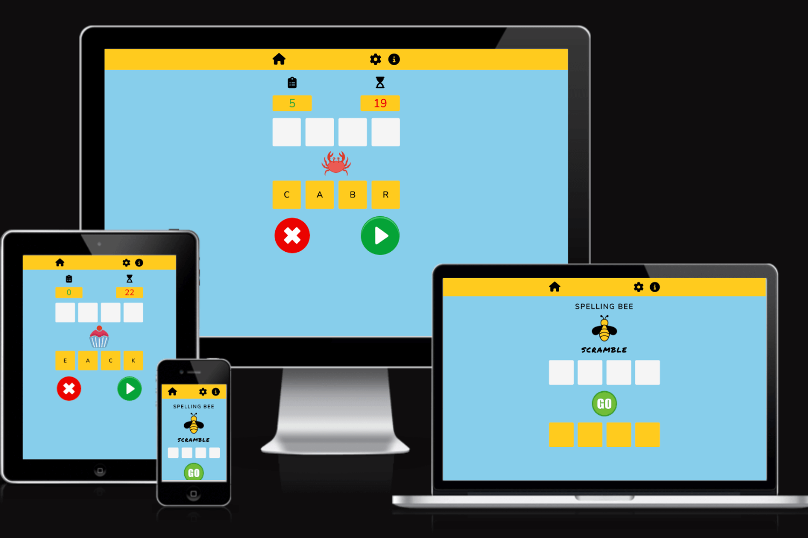
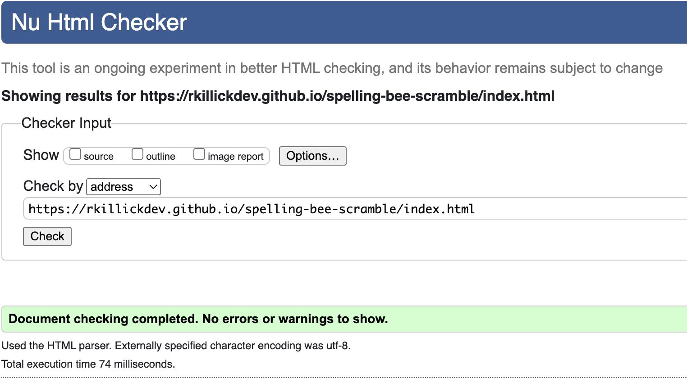

# **Spelling Bee Scramble Game**

Spelling Bee Scramble is a fun interactive game aimed at children of varying ages who are keen to practice and improve their spelling.  Players must decipher the scrambled words and spell them correctly by arranging the letters in the required order.  They work against the clock to complete the challenge.  The game has varying levels of difficulty to continue challenging the player.

<br>



<br>

[View the Spelling Bee Scramble site on GitHub Pages](https://rkillickdev.github.io/spelling-bee-scramble/)

<br>

## **CONTENTS**

* [User Experience (UX)](#user-experience-ux)
    * [Strategy](#strategy)
        * [Project Goals](#project-goals)
        * [User Stories](#user-stories)
    * [Design](#design)
        * [Features](#features)
        * [Wireframes](#wireframes)
        * [Colour Palette](#colour-palette)
        * [Contrast](#contrast)
        * [Typography](#typography)
        * [Imagery](#imagery)
* [Technologies Used](#technologies-used)
    * [Languages Used](#languages-used)
    * [Frameworks, Libraries and Programs Used](#frameworks-libraries-and-programs-used)
* [Deployment and Local Development](#deployment-and-local-development)
    * [How to Fork](#how-to-fork)
    * [How to Clone](#how-to-clone)
* [Testing](#testing)
    * [Automated Testing](#automated-testing)
        * [W3C Validator](#w3c-validator)
        * [Lighthouse](#lighthouse)
        * [WAVE](#wave)
    * [Manual Testing](#manual-testing)
        * [Testing User Stories](#testing-user-stories)
        * [Full Testing](#full-testing)
* [Bugs](#bugs)
    * [Known Bugs](#known-bugs)
    * [Solved Bugs](#solved-bugs)
* [Credits](#credits)
    * [Code Used](#code-used)
    * [Content](#content)
    * [Media](#media)
    * [Acknowledgements](#acknowledgements)

# **User Experience (UX)**

## **STRATEGY**
___

## **Project Goals**

<br>

To help children of all ages with their spelling by providing a fun and engaging interactive game.  The aim is that parents and schools can use the game with their children as part of their early years education and demonstrate that learning can be a fun experience which should keep them engaged and interested.

Anagrams are a useful tool when teaching children to spell, as it encourages them to consider each letter and how different letters group together to form certain sounds.

Word games and puzzles can also be beneficial for children in a variety of other ways.  They can help to improve working memory, help to broaden and extend their vocabulary, teach them problem solving skills and encourage a healthy sense of competition.

<br>

## **User Stories**

<br>

### Client Goals:

<br>

* As the client, I want to offer an educational experience to help children with their spelling.
* As the client, I want to make sure that the user has an enjoyable, engaging experience so they continue playing and return to the site in the future.
* As the client, I want to offer differing levels of difficulty to ensure that the user continues to learn as their spelling improves.
* As the client, I want to set targets for the user, to keep the experience interesting and challenging.
* As the client, I want to make the game responsive over a range of device sizes.

<br>

### First Time Visitor Goals:

<br>

* As a first time visitor, I am looking for a fun and interactive way to practice and improve my spelling.
* As a first time visitor, I want clear and concise feedback each time I submit a correct or incorrect answer.
* As a first time visitor, I want clear feedback about how close I am to reaching my target number of correct answers.
* As a first time visitor, I want clear feedback to let me know I have completed the challenge and how to proceed.
* As a first time visitor, I want easy intuitive access to an explanation of how to play the game.

<br>

### Return Visitor Goals:

<br>

* As a return visitor, I want to continue challenging myself and learn to spell more complicated words.

<br>

### Frequent Visitor Goals:

<br>

* As a frequent visitor, I want to be able to compete against myself to see how quickly I can complete the challenge and log this result on a leaderboard so I have a target to beat.

## **DESIGN**
___

## **Wireframes**

<br>

I used a mobile first approach when planning for this project, and wanted the overall visual of the game to be the same across all devices.  My wireframe therefore applies to mobile , tablet and desktop devices as the structure of the design does not change.  The section on [Responsive Design](#responsive-design) below explains how I tried to optimise the look of the game across various device sizes.

<br>


<br>

The wireframe above shows how the game was conceptualised, but ultimately a few of the ideas were out of the scope of this project.  These have been added to the [Future Implementations](#future-implementations) section below.


## **Features**

<br>

### **Navigation Bar**

<br>


Icons are used here rather than text to save space.  Players can navigate to the settings page by clicking on the universally recognisable gear icon.  Here they are presented with the option to select a difficulty level rather than starting on the default level of "easy".  Re-clicking the gear icon or clicking on the cross icon hides this page and the player is once again presented with the game page.


Clicking on the information icon presents the player with instructions on how to play the game.  The page can be hidden by re-clicking the information icon or clicking the cross icon.


<br>

### **Game Landing Screen**

<br>


On loading the site, players are greeted with the Spelling Bee Scramble logo and a 'go' button inviting them to play.  I have chosen to have the main game name and logo displayed here, rather than having it permanently displayed at the top which would take up valuable screen space.  This is especially important when taking into account that this game is mostly likely to be played on a mobile device where screen real estate is at a premium.

<br>

### **During Play**

<br>

On hitting play, four, five or six empty boxes appear below the central logo (depending on the game difficulty setting).  The scrambled word letters appear in these boxes.  Empty answer boxes also appear above the logo box.  A picture hint for the scrambled word appears in ther central display.


<br>


<br>


The player must identify the word and spell it correctly by clicking on each letter in the right order.  Once a letter has been clicked, it becomes greyed out and inactive so it cannot be used again.  This is an example of where I used code to intelligently handle invalid input data, by disabling each button after it is clicked.  Without this code, players would be able to input the same letter multiple times.   Once a letter is clicked, it appears in the next unpopulated answer box above the picture hint.

Once the player is happy with their spelling of the word, they can submit their answer with the green 'play' button.  This is then checked against the correct spelling of the word and the player is provided feedback.  If the players answer matches, all squares turn green and a green tick appears.  A new scrambled word is then generated and the answer boxes are cleared, ready for the next spelling attempt.


If the user's answer is incorrect, all squares turn red and a red cross appears.


On the control panel, the red 'cross' button gives the player the option to clear their spelling if they decide they have gone wrong.  This clears all populated answer boxes.


<br>

### **Game Progress Section**

<br>


The counter increments by 1 every time the player submits a correct answer.  Once the counter reaches 6, the challenege is complete.Players are working against a countdown clock.  They must spell 6 words correctly within 60 seconds to successfully complete the challenge.  The countdown starts as soon as the scrambled word and picture hint is generated. 

<br>

### **Game Outcome Feedback**

<br>

If the player spells 6 words successfully within the time limit, players are greeted with a bespoke message of congratulations dependent on the level they have completed.  The next time they run the game, the level of difficulty will increase.  Once they have completed the hardest level, they can continue to practice on this setting.


<br>


<br>


<br>

If the player is unable to submit 6 successfully spelt answers within the time limit, they are presented with a record of the number of additional correct answers they needed and a message encouraging them to try again.

 

<br>

### **Footer**

<br>

After some consideration and discussion with my mentor, I decided to include a minimalistic footer that provides information about the developer behind the game and offers a clickable link to the Spelling Bee Scramble github repo, represented by the github font awesome icon.  Styling of the footer is consistent with the rest of the game, with a hover effect applied to the clickable icon to match the icons in the nav bar at the top.  The link opens in a new tab.


<br>

### **404 Error Page**

<br>

I have included a 404 error page as a form of defensive design for when "things go wrong" - otherwise known as contingency design. This improves the user experience if they should try to access a page on the site that does not exist or has been moved.  The aim of this page is to keep the user informed about the problem and engaged with the site, as the styling and branding used on this page is consistent with the rest of the game.  For example the "Sorry" message is styled in the same 'Permanent Marker' font used in the game title and answer boxes.  The appearance of the bumblebee reminds them that they are still connected to the Spelling Bee Scramble site.  Finally, the 404 page minimises frustration in the user ny making navigation back to the game landing page simple and intuitive by offering a "reload" icon to click.  This also ensures that the user does not decide to navigate away from the site.


<br>

### **Responsive Design**

<br>

Answer and scramble squares have been made responsive so they get larger as the screen width increases, but also remain square.  This is capped at 500px screen width otherwise they start to look too big.  Font size has also been made reponsive to grow with the squares.


<br>

When testing the game on smaller devices such as phones, I noticed that game play was less user friendly when the device was rotated to landscape orientation, as the player is not able to view all the necessary elements of score/ timer, answer boxes, picture, scramble boxes and controls without scrolling up and down.  I considered using a media query to shrink everything to fit the screen in these situations or removing some elements, but none of these solutions were workable as there is too much information to fit in that space.  I therefore decided to set an event listener in my JavaScript file which responds when the screen height goes below 400px and displays a warning message, advising the player to rotate their device back to portrait orientation for a better game play experience.  I learnt about using matchMedia in JavaScript from the [following article](https://fjolt.com/article/javascript-detecting-device-orientation).

I decided against basing the event listener on the css property (orientation: landscape), as I found this was also causing the message to appear on larger devices such as laptops and desktops where screen width is larger than screen height, but the screen height is adequate to display the whole game.


<br>

I used Media queries to increase the size of images and counters, for screens above 1200px in height, to use some more of the vertical screen real estate.

<br>

| Responsivness |    |           |            |           |                         |                  |       | Notes  |
| :---: | :---:        | :---:     | :---:      | :---:     | :---:                   | :---:            | :---: | :---:  |
| ---   | iphone 6/7/8 | iPhone 11 | Galaxy S8+ | iPad Mini | iPad | Macbook Pro 2021 | Desktop > 1200px |    
| Site responsive >= 700px | n/a | n/a | n/a | Good | Good | Good | Good |
| Site responsive < 699px | Good | Good | Good | n/a | n/a | n/a | n/a |
| Images display as expected | Pass | Pass | Pass | Pass | Pass | Pass | Pass |
| Renders as expected | Pass | Pass | Pass | Pass | Pass | Pass | Pass |

<br>

### **Accessibility**

To ensure that the game is as accessible as possible for all users and compatible with screen readers, I included the following:

* Semantic markup has been used where possible to structure the HTML code.
* I checked that the colour contrast ratio across the site meets acceptable standards.  When choosing the colour palette, I experimented using the [WebAIM website](https://webaim.org/resources/contrastchecker/) to check that the contrast between background colours and text would be acceptable.
* Descriptive alt attributes have been given to all images.  I was also careful to add this attribute dynamically for any images that are injected into the DOM using JavaScript.  The alt description for each picture is stored within each object in the wordCollection array. 
* I have used aria labels for interactive elements such as buttons where no accessible name is provided.
* I have used the aria hidden attribute on any icons that are purely decorative.
* When running my HTML code through the W3C markup validation service, I was warned that I was using some section elements that did not contain a heading element.  I therefore changed these to divs and gave them the attribute role="region" and an aria label to explain their purpose.

### **Future Implementations**

* Sound FX could be used as an additional form of feedback for players to understand whether they have submitted a correct or incorrect answer.  This could also add an extra element of fun to the game for kids.
* Some of the visual elements could be made more interesting and engaging, for example the score counter could be animated.  Also letters and images appearing on the page could have interesting transitions such as flipping or spinning as they change.
* A leaderboard could be implemented if player scores could be stored in a database. This was not in the scope of the project but something to consider for the future with the addition of other technologies.
* Lots more words and images can eventually be stored in the wordCollection array to keep the challenges varied and reduce the amount of times the same word appears.

<br>

## **Colour Palette**

Colours used are bright, vivid and fun to appeal to the target audience.

For the yellow colour used in the header and scramble boxes, I matched the yellow used in the bumble bee icon with a tool on the [coolors](https://coolors.co/) website:


<br>

## **Typography**

Spacing and typography is consistent throughout the game and I have aimed to use something playful and appealing to children.  Inspiration came from the following [article](https://inkbotdesign.com/google-font-combinations-mixing-typefaces/).
The answer letters appear in the answer boxes as the permanent marker font, to give the impression they have been scribbled in there, again adding a playful element that children should enjoy.

* Headings: Nunito.  This is a sans-serif font.
* Body: Nunito Sans. This is a sans-serif font.
* Scramble title and answer boxes: Permanent Marker.  This is a cursive font. 

## **Imagery**

As this is a game aimed at children, I have used imagery appropiate for this goal.  The picture hints were sourced royalty free from [uxwing](https://uxwing.com/).  The bold colors and animated style make the images easily recognisable and appealing to children, and gives the game a sense of fun.

The bumble bee logo displayed on the game landing page ties in with the theme of a Spelling Bee.

The styling of the scramble and answer boxes is simple and reminiscent of scrabble tiles - this familiar imagery should mean that the game is intuitive and the purpose of the game becomes apparent without even reading the instructions.

Player controls are kept minimal and styled in a way that makes game play intuitive.  The green 'go' button invites the player to get started and the green play button and red cross button communicate their purpose to the player without any need for text.

<br>

# **Technologies Used**

## **Languages Used**

<br>

HTML, CSS and JavaScript were used to create the game.

<br>

## **Frameworks, Libraries and Programs Used**

<br>

* Git -  Version control.
* GitHub - All files for the website stored and saved in a repository.
* GitHub Pages - Used to deploy the final version of the website.
* Balsamiq - Used to create wireframes.
* Font Awesome - Used for all icons throughout the website.
* Google Fonts - Used to import required fonts for the website via the css style page.
* Google Developer Tools - Used throughout build of website for debugging, checking responsiveness and trialing new features/ styling.
* Google Lighthouse - Used at testing stage to show statistics for performance, accessibility,  best practices and SEO.
* TinyPNG - For compression of image files to improve website performance.
* Birme - For resizing and re-formatting images to make them suitable for use on the website.
* Am I Responsive? - For displaying images of how the website looks across a range of devices.
* Favicon.ico & App Icon Generator - for creating the 16x16px ico favicon.
* [Meta Tags IO](https://metatags.io/) for improving site visual appearance on social media.

<br>

# **Deployment and Local Development**

<br> 

## **Deployment**

<br>

The live website has been deployed using GitHub Pages, following the steps below:

1. Log in (or sign up) to GitHub.
2. Click on the required repository, in this case: rkillickdev/spelling-bee-scramble
3. Go to the "Settings" menu.
4. Select the "Pages" tab in the left hand menu - this will jump you to a section called "GitHub Pages".
5. Under the Build and deployment section, select "main" from the select branch menu.  Select "root" from the dropdown select folder menu.
6. Click save.  The URL for your live site which has been deployed on GitHub pages is shown at the top of the GitHub pages section.  This sometimes does not display immediately or may require a browser refresh.

The live link can be found [here](https://rkillickdev.github.io/spelling-bee-scramble/)

<br>

## **Local Development**

<br>

### **How to fork:**

<br>

1. Log in (or sign up) to GitHub.
2. Find the required repository, in this case: rkillickdev/spelling-bee-scramble
3. Click on the "fork" button at the top right of the page.

<br>

### **How to clone:**

<br>

1. Log in (or sign up) to GitHub.
2. Find the required repository, in this case: rkillickdev/spelling-bee-scramble
3. Click on the green code button.  This will give you the choice of cloning the repository using HTTPS, an SSH key or GitHub CLI.  Make your selection and copy the provided URL link.
4. Open Terminal
5. Change the current working directory to the location where you want the cloned directory.
6. Type 'git clone' and then paste the URL you copied earlier.
7. Press enter.

<br>

# **Testing**

## **Automated Testing**

<br>

### **W3C Validator:**

<br>

I used the [W3C](https://validator.w3.org/) Markup Validation Service to validate the index.html page.  It passed with no errors or warnings:



<br>

I used the [W3C jigsaw](https://jigsaw.w3.org/css-validator/) CSS Validation Service to validate my CSS stylesheet. It passed with no errors:


The following warnings were raised, which relate to the vendor extenstions I am using for browser cross compatability:


<br>

I passed my JavaScript code through the linter Jshint to validate and check for any syntax errors.  The only remaining warning relates to the variable wordCollection as this is defined in the words.js file.


<br>

The words.js file was also validated in Jshint.  It notes that the variable wordCollection is unused.  This is because it is used in the script.js file.

### **Lighthouse:**

<br>

I used Lighthouse within Google Chrome developer tools as a way of testing performance, accessibility, best practices and SEO of the site.

<br>

### **Desktop Results**

<br>


<br>

### **Mobile Results**

<br>


<br>

### **WAVE:**

<br>

I have used the [WAVE](https://wave.webaim.org/) tool to evaluate the web accessibility of each page on the site.  It passed with no errors:


## **Manual Testing**

<br>

### **Testing User Stories:**

<br>

| Goals | How are goals achieved? |
| --- | --- | 
| **Client** |     
|        |   
| I want to offer an educational experience to help children with their spelling. | This is achieved by offering 3 difficulty levels of spelling challenges to help children keep progressing in their learning. | 
| I want to make sure that the user has an enjoyable, engaging experience so they continue playing and return to the site in the future. | The site has been designed to be simple and intuitive, challenges different abilities and the aesthetics of the game align with the target user by being bright, bold and fun. | 
| I want to offer differing levels of difficulty to ensure that the user continues to learn as their spelling improves. | This is achieved by offering a settings page where the difficulty level can be adjusted manually by the player. |
| I want to set targets for the user, to keep the experience interesting and challenging. | Targets are set by requiring the player to achieve 6 correct answers to sucessfully complete the challenge. |
| I want to make the game responsive over a range of device sizes. | The site has been tested over a range of devices and is responsive while retaining the same structural layout throughout. |
|        |                                                  
| **First Time Visitors** |         
|        | 
| I am looking for a fun and interactive way to practice and improve my spelling. | Opportunity to improve spelling is offered by 3 different levels of challenge.  The site is fully interactive and control of the game is intuitive.  The fun element is brought by deign elements such as cartoon images and feedback to let the player know how they are progressing. |
| I want clear and concise feedback each time I submit a correct or incorrect answer. | Green ticks/answer boxes for correct answers and red crosses/ answer boxes for incorrect answers are used to give players feedback about each spelling they submit. | 
| I want clear feedback about how close I am to reaching my target number of correct answers. | The score counter displayed in the top left of the screens provides this continual feedback during game play. |
| I want clear feedback to let me know I have completed the challenge and how to proceed. | Bespoke messages are displayed to the player at the end of each challenge providing feedback and next steps. |
| I want easy intuitive access to an explanation of how to play the game. | The instructions page providing this information is easily accessible from the nav bar with one click and intuitive for players to find with the use of universally recognisable 'info' icon. |
|        |
| **Return Visitors** | 
|        |
| I want to continue challenging myself and learn to spell more complicated words. | The three levels of game difficulty ensure this is possible.  This can either be done by following the flow of the game and completing challenges in order, or children with a higher level of spelling ability have the option to jump straight to medium or hard levels via the settings page. | 
|        |
| **Frequent Visitors** |
|        |
| I want to be able to compete against myself to see how quickly I can complete the challenge and log this result on a leaderboard so I have a target to beat. | This story is partially achieved in that players can compete against the clock to complete the challenges quicker, but ability to log results on a leaderboard would be a future implementation with the integration of a database to store player scores and details. |

<br>

### **Full Testing:**

<br>

Full testing has been carried out on the following devices:

* Macbook Pro 2021 14 inch M1 Pro
* iPhone 11
* iPad 9th generation A2602

The following browsers were used to test on each device:

* Google Chrome
* Firefox
* Safari

<br>

| Browser Compatability |  |        |            |           | Notes |                        
| :---: | :---:  | :---:   | :---:  | :---:| :---: |
|       | Chrome | Firefox | Safari | Edge |  
| Appearance | Good | Good | Good | Good |
| Responsiveness | Good | Good | Good | Good |

<br>

| Feature | Expected Outcome | Testing Performed | Result | Pass/Fail |
| ------- | ---------------- | ----------------- | ------ | --------- |
| Navbar  |
|         |
| Navbar icons | Scale expands by 10% and colour transitions to grey when hovered over | Hover over navbar icons | Scale expands by 10% and colour transitions to grey | Pass | 
| Home Icon | User redirected to home screen and game resets to default settings when clicked | Click home icon | Redirected to home screen and game is on easy setting when run | Pass |
| Settings Icon | Settings page appears when clicked | Click settings icon | Settings page appears | Pass |
| Settings buttons | Appear dark when selected and light when not | Toggle between buttons | Button becomes dark when selected and is not untoggled when clicked again | Pass |
| Easy, medium & hard settings buttons | Changes difficulty of game when clicked | Click each button and run game | 4 letter words displayed when easy clicked, 5 letter words when medium clicked and 6 letter words when hard clicked | Pass |
| Cross Icon on settings page | Hides Settings page | Click cross icon | Settings Page is hidden | Pass |
| Info Icon | Shows instructions page | Click info icon | Instructions page is shown | Pass |
| Cross Icon on instructions page | Hides instructions page | Click cross icon | Instructions page is hidden | Pass |
|        |
| Top Display |
|             |
| Landing display | Game title and logo displayed | refresh page | Spelling Bee Scramble title and Bumble Bee logo displayed | Pass |
| Progress display | Score counter and countdown timer shown when game runs | Click 'go' button to run game | counter and countdown timer displayed | Pass |
| Score counter | Starts at 0 and increments by 1 each time a word is spelt correctly | Run game and submit some correctly spelt answers | Score counter increments by 1 each time a correct answer is logged | Pass |
| Countdown timer | Starts at 60 seconds and counts down to zero | Run game | Timer starts counting down from 60 seconds | Pass |
| Challenge complete message | When target number of correct answers reached in under 60 seconds, message displayed to player relevant to difficulty level completed | Run a game at each difficulty level and complete challenege | Difficulty specific message displayed after each challeneg completed | Pass |
| Time up message | When the countdown timer reaches zero nad the target number of answers has not been met, an encouraging message is displayed with the number of correct answers the player needs next time | Run game and let timer reach zero having spelt a varying number of words correctly  | encouraging message displayed and relevant number inserted in message based on how many answers were correct on the previous game | Pass |
|            |
| Game Section |
|              |
| Green 'Go' button | Displays scrambled word (based on current difficulty level) in yellow scramble boxes and displays picture hint for scrambled word | Run games at all 3 difficulty levels | 4 letter words displayed  on easy level, 5 letter words on medium level, 6 letter words on hard level.  Picture matches word | Pass |
| Scramble Boxes | Clicking on scramble box populates the next avaialble answer box with that letter and then makes scramble letter inactive and greyed out | Click on scramble box letters | Answer boxes populated in correct order as scramble letters clicked.  Letters can only be clicked once as they become inactive after first click | Pass |
| Green play button | Checks spelling of answer as it appears in answer boxes and adds a point to the score counter if correct | Spell some words correctly and incorrectly and click play button | Correct answers inrement the score counter by 1 | Pass |
| Red cross button | Clears answer boxes of all letters | Populate some answer boxes and then click red cross | Answer boxes cleared | Pass |
| Answer Boxes Correct | Turn green momentarily and green tick appears above if answer submitted is correct | Spell a word correctly and click green play button | Answer boxes turn green momentarily and a green tick apears | Pass |
| Answer Boxes Incorrect | Turn red momentarily and red cross appears above if answer submitted is incorrect | Spell a word incorrectly and click green play button | Answer boxes turn red momentarily and a red cross apears | Pass |  


<br>

## **Bugs**

<br>

### **Known Bugs:**

<br>

### **Solved Bugs:**

<br>

**1.**  When trying to loop through the variable scrambleButtons using the forEach() method, the console in google developer tools threw the following error:


* On researching this I found the [following article:](https://stackdiary.com/guides/typeerror-foreach-is-not-a-function/) 

* This explains that the error occurs when the code attempts to call the forEach() method on a value that is not an array or an array-like object.  To solve this, I transformed scrambleButtons into an array using the following code:

```js

const buttonArray = Array.from(scrambleButtons);

```
___

**2.**  I created an event listener for the answer button which runs the checkAnswer function. The final step of this function is to run the playGame function in order to clear the boxes and generate a newly scrambled word.  However the playerAnswer array was not being cleared and was causing the issue as demonstrated below:


* I fixed this by using the following line of code within the playGame function to clear the playerAnswer array:

```js

playerAnswer.length = 0;

```

___

**3.**  When setting up the timer, I made this element avaialble in the JavaScript file initially using getElementById("timer").  However this caused the text in my scramble letter boxes to disappear as shown in the snapshot below:


* Using querySelector instead to select the span in the HTML file with the id="timer" resolved this issue as can be seen below:


___

**4.**  When I was trying to set the src file path of an image in my JavaScript file using a template literal, the innerHTML was sucessfully updated but the image was not displaying:  Instead a broken image file was shown which suggested my file path was incorrect.  My original file path stored in an object read as this:

```js

picture: "../assets/images/fresh-apple-icon.png",

```

* After some research and reading [this thread on the Code Institute Slack channels](https://code-institute-room.slack.com/archives/C7EJUQT2N/p1653076076263549?thread_ts=1653073079.354849&cid=C7EJUQT2N), I discovered that although the image file path is loaded from JavaScript, it is executed from the HTML so the path should be from the HTML file to the images so I updated the path to this and the image displayed as expected:

```js

picture: "assets/images/fresh-apple-icon.png",

```

___

**5.**  I encountered a bug with the score counter on submitting a correct answer.  The score was not increasing and the following message appeared in the console:


* I realised the problem was that the variable **score** (gets element by Id "score") was being defined in global scope, but the HTML containg this element with an id of "score" only exists once the gameToggle function is run with an argument of "game".  I therefore defined the variable **score** within the addPoint function instead, which solved the problem as by the time this function is run, an HTML element with the id of "score" exists in the DOM.  See code below:

```js

function addPoint() {
    let score = document.getElementById("score");
    totalScore++;
    score.innerText = totalScore;
    if (totalScore >= 2) {
        gameToggle("hide");
        displayMain.innerHTML = "Congratulations!";
    }
}

```

As the code evolved, I ended up making changes so the HTML for the score counter lives permanently in the index.html file and is displayed using show and hide.  This made the bug described above less relevant, and the variable is now once again able to live in global scope.
___

**6.**  When I decided to display the scramble and answer letters as uppercase, the checkAnswer function stopped working so even if my spelling was correct, it did not recognise this as a correct answer. I realised that the correctAnswer variable as set in the generateWord function needed to be in uppercase before checking the submittedAnswer against this.  I wrote the following code to achieve this:

```js

let correctUpperAnswer = correctAnswer.toUpperCase();

```

* An alternative would be to have all words stored in uppercase within the wordCollection array of objects.

___

**7.**  A problem I encountered while testing during the build was that somtimes the scrambled word would in fact be the correct spelling.  To prevent this happening I modified the generateWord function and added the following line of code:

```js

    if (scrambledString === correctAnswer) {
        return;
    }

```
___

**8.**  I was experiencing a problem where from time to time, when hitting the go button or logging an answer, a new word would not be shown.  Frustrating as it would seem to happen randomly but fairly frequently.  There was no error logged on the console, but using console logs in my code, I tracked down that the problem was coming from the GenerateWord function.  And then more specifically the code I had written to deal with cases where the string of scrambled letters saved in the variable scrambledString was identical to the correct spelling of the word (See bug 7 above).  I therefore needed a way to rescramble the letters in these situations before the rest of the generateWord function could run.  I separated the letter scrambling into it's own function called scrambleWord and then used a while loop to continue running this function until the condition evaluates to false:

```js

while ((scrambledString === correctAnswer)) {
        scrambleWord();
    }

```

___

**9.**  I encountered a problem with my display functions as shown below.  Having completed the challenge at the top level of difficulty, the player has the chance to play again to continue testing themselves.  But on running the game again, the display would jump to a 5 column grid layout:


* I realised that this was because of the way I had my display functions set up to toggle between grid layouts depending on the difficulty setting.  This worked when switching from easy to medium, and medium to hard, but running hard a second time was actually toggling back to the medium display.  I decided to simplify these functions and rather than use toggle, replace the class each time a difficulty level changes, as shown in the example below for the function easyDisplay:

```js

document.getElementById("answer-tiles").className = "grid grid-tiles-4";
document.getElementById("scramble-tiles").className = "grid grid-tiles-4";

```

Since writing up this bug fix, I have changed and streamlined the code for my lettersDisplay function, but the theory of how I fixed this problem remains.
___

**10.**  After implementing the code to switch difficulty level in the settings page, I found a bug where if you tried to set the level from hard to medium, the sixth answer and sramble box remained visible rather than hidden as expected:


* On investigating my function mediumDisplay, I realised that I had not specified what should happen to these boxes.  On adding the two lines of code shown below, the bug was resolved:

```js

answerBoxes[5].style.display = 'none';
scrambleBoxes[5].style.display = 'none';

```

Since writing up this bug fix, I have changed and streamlined the code for my lettersDisplay function, but the theory of how I fixed this problem remains.
___

**11.**  A problem I encountered quite early while testing was that with my initial methodology for generating a random word from the challengeWords array, this would quite regularly result in the same word being displayed several times during a game.  I explored several ways of fixing this, initially pushing each word to a new array once used.  These were then only re-introduced when the challenegeWords array was empty.  This was one solution but on discussing with my Mentor Can, I decided a better approach would be to choose words from the challengeWords array using a shuffled integer array.  Once an integer has been used it is moved to the back of the challengeIndexes array and will only be used again once all the avaialble words have been used.  For each new game, the integer array is shuffled randomly using the Fisher Yates method so words do not always appear to the player in the same order. 

___

**12.**  When viewing on my IOS devices, the text in the scramble boxes was displaying as pale blue rather than black like the rest of the text in other areas of the game.  Explicity setting the color property for the class "btn" solved this problem.

___


# **Credits**

## **Code Used**

* [Referenced this article on Stack Overflow for solution to how setting difficulty level changes which object the random word is chosen from](https://stackoverflow.com/questions/64712803/change-game-difficulty-javascript)
* [Referenced this tutorial on YouTube on how to generate the random word and how to split and scramble](https://www.youtube.com/watch?v=4-s3g_fU7Vg)
* [Adding a single event listener for all buttons of a certain class](https://stackoverflow.com/questions/49680484/how-to-add-one-event-listener-for-all-buttons)
* [getting inner text on button click](https://stackoverflow.com/questions/69663406/how-to-get-value-from-button-after-it-has-been-clicked)
* [How to check if a div is empty](https://bobbyhadz.com/blog/javascript-check-if-div-is-empty)
* [Disabling scramble letter buttons after click so it cannot be selected more than once](https://stackoverflow.com/questions/23724639/make-a-button-unclickable-after-one-click)
* Used this [article](https://css-tricks.com/overriding-default-button-styles/) to learn about removing default styling from buttons.  Referenced and modified some code [here](https://codepen.io/andy-set-studio/pen/Vxpjvo)
* Referenced these articles when considering how to make the square tiles responsive and stay square across various screen sizes. [Article 1](https://stackoverflow.com/questions/66817240/how-to-make-css-grid-container-keep-responsive-square-size) and [Article 2](https://stackoverflow.com/questions/46548987/a-grid-layout-with-responsive-squares) gave me the soution to use 100% padding-top on my button-container class.
* Referenced this [article](https://matthewjamestaylor.com/responsive-font-size) when considering how to make font size responsive.
* Referenced [this code](https://www.tutorialspoint.com/what-is-fisher-yates-shuffle-in-javascript) when finding a solution for shuffling an array of integers randomly.
* Referenced and modified [this code](https://softauthor.com/make-selected-clicked-button-active-in-javascript/) when exploring ways of toggling the font awesome icon used each time a button clicked on the settings page to change the difficulty level.
* [Article about using divs instead of sections where no heading element present](https://www.beacontechnologies.com/blog/2018/12/how-to-add-aria-labels-for-html-section-and-div-tags.aspx)
* Referenced [this article](https://www.geeksforgeeks.org/what-is-the-self-executing-function/) to learn about wrapping the code in a file with a self executing function

<br>

## **Content**

* [Article about using word scrambles to improve spelling](https://ourfamilylifestyle.com/exercises-to-help-children-improve-spelling-skills/)
* [Article about the benefits of word games for children](https://www.theschoolrun.com/10-ways-word-puzzles-can-help-your-child)
* [Inspiration for google fonts pairings](https://inkbotdesign.com/google-font-combinations-mixing-typefaces/)

<br>

## **Media**

* [Royalty free images used for the game logo and word hint pictures](https://uxwing.com/)

<br>

## **Acknowledgements**